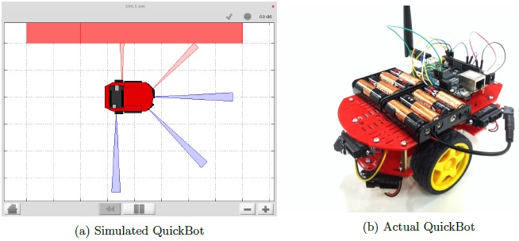
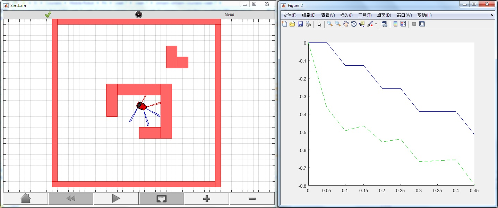
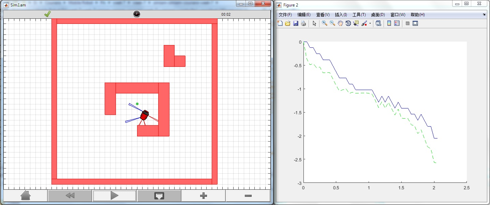
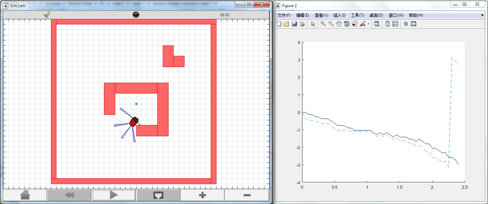
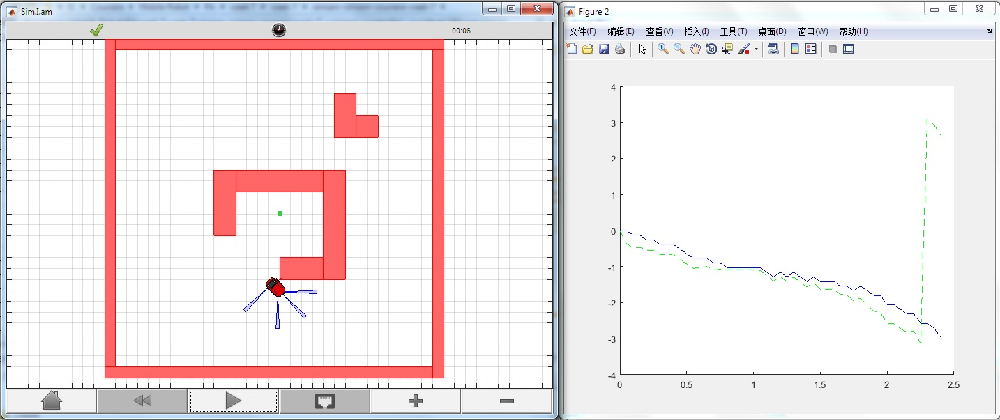
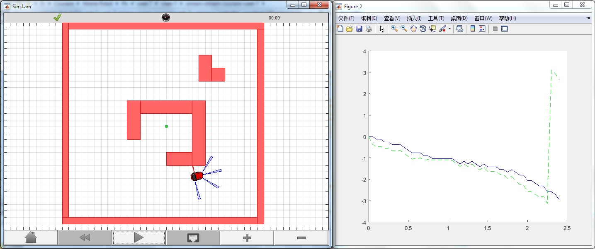
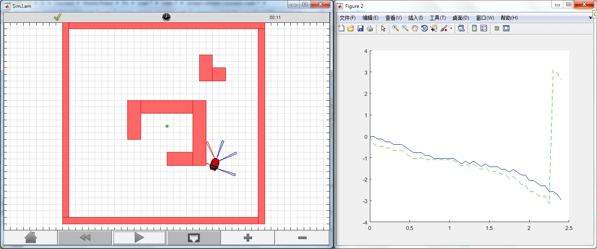
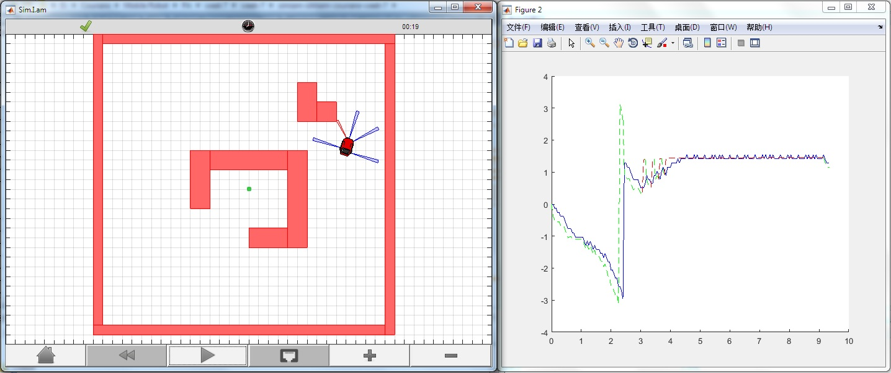
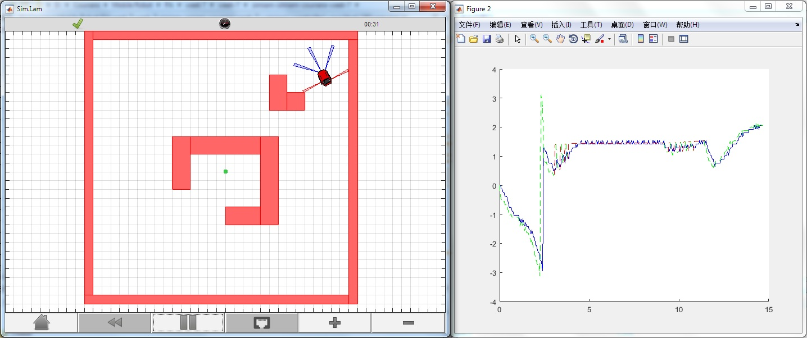

# Robotics - Control of Mobile Robot
This repository contains my implementation of the programming asssignments of Control of Mobile Robots course delivered by Georgia Institute of Technology on Coursera

## 1. Mobile Robot Simulator
The programming exercises use a simulated version of a robot called the QuickBot. The simulated QuickBot is equipped with five **infrared (IR) range sensors**, of which three are located in the front and two are located on its sides. The simulated QuickBot has a two-wheel difierential drive system (two wheels, two motors) with a wheel encoder for each wheel. You can build the QuickBot yourself by following the hardware videos located under the Course Resources tab.

## 2. Differential-Drive, Odometry, and IR
The purpose of this week’s programming assignment is to implement the functions for the robot to **move and sense**.

    1. Transform the outputs of our controllers to the control inputs of the mobile robot.
    2. Keep track of where the robot is located.
    3. Convert raw sensor values to distances.

## 3. Go-to-Goal PID Controller
The purpose of this week’s programming assignment is to implement a go-to-goal PID controller.

    1. Implement the proportional, integral, and derivative terms of the controller.
    2. Adjust the gains for performance.

## 4. Obstacle Avoidance
The purpose of this week’s programming assignment is to avoid any obstacles near the robot.

    1.Transform the IR distance to a point in the robot’s coordinate frame.
    2.Transform this point from the robot’s coordinate frame to the world coordinate frame.
    3.Compute a vector that points away from any obstacles.
    
## 5. Arbitration
We will use two arbitration techniques, blending and hard switching, to drive to a goal while avoiding obstacles.

    1.Blend go-to-goal and avoid-obstacle vectors in one controller.
    2.Switch between go-to-goal and avoid-obstacle controllers separately.
    3.Use the blended controller as an intermediary.

## 6. Following Walls
This week we will add a new controller to follow walls.

    1.Estimate a section of a wall (obstacle) using the IR sensors.
    2.Compute a vector tangential to the wall and perpendicular to the wall.
    3.Combine the two vectors and steer in the direction of this new vector.
    
## 7. Navigation
This week we need to answer three questions to achieve navigation through the obstacle course:
    1.Is the robot making progress towards the goal?
    2.Should the robot follow the wall to the right or the left?
    3.If the robot is in state “A” and event “2” becomes true, then to which state should the robot switch?

